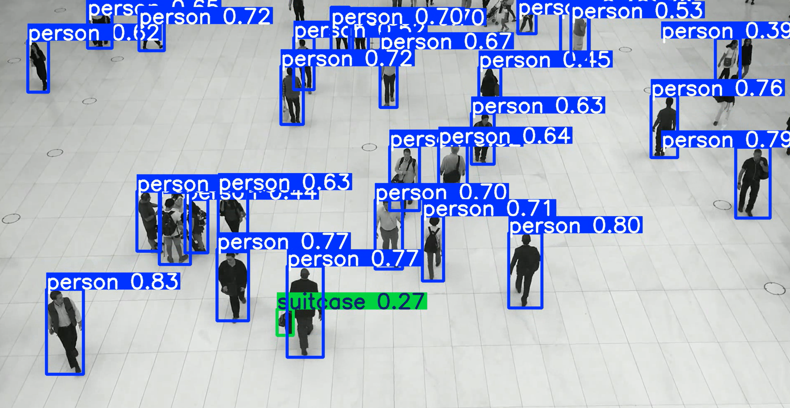

# Blob Tracking with OpenCV

A computer vision project that combines YOLO object detection and MediaPipe pose estimation for real-time human pose tracking and object detection in videos.

## Overview

This project processes video files to detect and track human poses using two powerful machine learning frameworks:
- **YOLO**: For general object detection and tracking
- **MediaPipe Pose**: For detailed human pose estimation with 33 landmark points

The system outputs annotated videos with bounding boxes around detected objects and skeletal pose overlays on human figures.

## 📋 Requirements

### Dependencies
- `opencv-contrib-python`
- `mediapipe`
- `YOLO` from `ultralytics`

## 🛠️ Installation

1. **Clone the repository:**
   ```bash
   git clone https://github.com/SebastianManoli/block-tracking-opencv.git
   cd block-tracking-opencv
   ```
```
BLOB_TRACK/
├── blob_track.ipynb          # Main Jupyter notebook
└── README.md                # This file
```

1. **Install dependencies:**
   ```bash
   pip install opencv-contrib-python mediapipe ultralytics --upgrade
   ```

## 🎮 Usage

### Basic Usage

1. **Open the Jupyter notebook:**
   ```bash
   jupyter notebook blob_track.ipynb
   ```

2. **Configure input/output files:**
   ```python
   input_video = "walking.mp4"      # Your input video file
   output_video = "output.mp4"      # Desired output filename
   ```

3. **Run all cells** to process the video.


## 📊 Output

Screenshot from output.mp4


## 🔬 Technical Details

### MediaPipe Pose Model
- **33 landmark points** covering full body
- **Real-time performance** optimized
- **Robust tracking** in various lighting conditions

### YOLOv8 Integration
- **Nano model** for fast inference
- **80 object classes** from COCO dataset
- **Real-time object tracking**

---

**Note**: This project is designed for personal and educational purposes to demonstrate the integration of multiple computer vision technologies for human pose tracking and object detection.